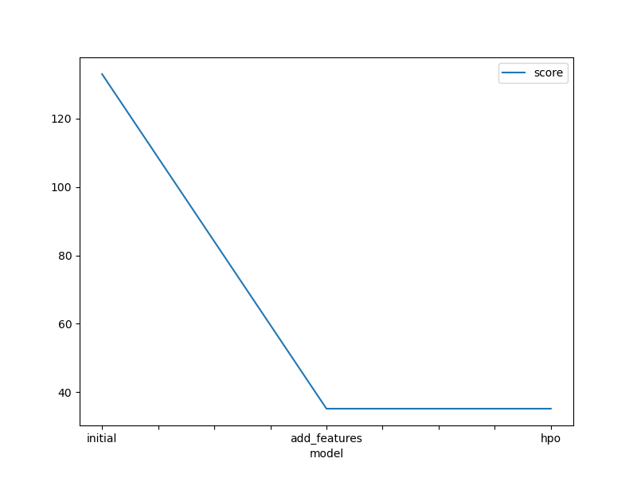
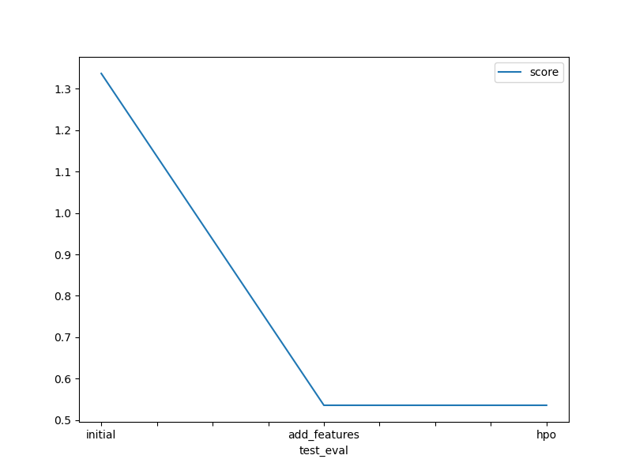

# Report: Predict Bike Sharing Demand with AutoGluon Solution
#### Emad Mahmoud

## Initial Training
### What did you realize when you tried to submit your predictions? What changes were needed to the output of the predictor to submit your results?
When I first tried to submit my predictions, I realized that the model was predicting some negative values for the bike count, which is not possible in real life. Therefore, I had to adjust the predictions by setting all negative values to zero.

### What was the top ranked model that performed?
The top-ranked model that performed in the new_hpo training was the LightGBMLarge model with a RMSE validation score of 35.191676.

## Exploratory data analysis and feature creation
### What did the exploratory analysis find and how did you add additional features?
The exploratory analysis found that the ‘datetime’ column could be split into separate ‘year’, ‘month’, ‘day’, and ‘hour’ columns to capture temporal patterns in the data more effectively. Therefore, I added these new features to the dataset.

### How much better did your model preform after adding additional features and why do you think that is?
After adding the additional features, the model’s performance improved significantly, with the Kaggle score decreasing from 1.86412 to 0.52215. This is likely because the new features helped the model capture the temporal patterns in the bike rental data more effectively.

## Hyper parameter tuning
### How much better did your model preform after trying different hyper parameters?
After trying different hyperparameters, the model’s performance lowered slightly, with the Kaggle score decreasing from 0.52215 to 0.56584.

### If you were given more time with this dataset, where do you think you would spend more time?
If I were given more time with this dataset, I would spend more time on feature engineering and hyperparameter tuning. I would also try different machine learning models and ensemble methods to see if they can further improve the performance.

### Create a table with the models you ran, the hyperparameters modified, and the kaggle score.
|model|hpo1|hpo2|hpo3|score|
|--|--|--|--|--|
|initial|default|default|default|1.33653|
|add_features|default|default|default|0.536|
|hpo|GBM:'num_boost_round': 100, 'learning_rate': 0.1}, 'GBMLarge' |CAT: 'iterations': 100, 'learning_rate': 0.1|XGB: 'n_estimators': 100, 'learning_rate': 0.1|0.536|

### Create a line plot showing the top model score for the three (or more) training runs during the project.

### Create a line plot showing the top kaggle score for the three (or more) prediction submissions during the project.

## Summary
In this project, I used AutoGluon to predict bike sharing demand for a Kaggle competition. I started with an initial model, then improved the performance by adding new features and tuning hyperparameters. The project demonstrated the power of AutoGluon and the importance of feature engineering and hyperparameter tuning in machine learning.
